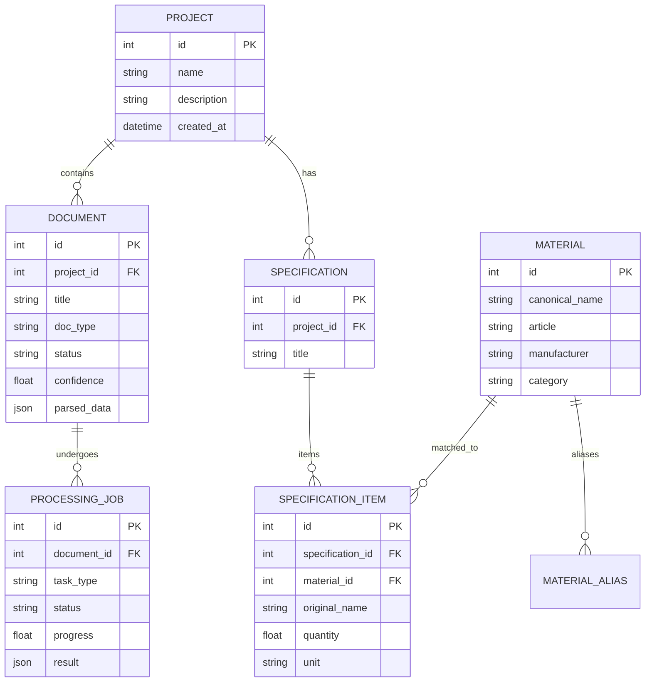

# ⚙️ Системная Архитектура Проекта (System Architecture & Backend)

> Документация монорепозитория, модели данных SQLAlchemy, REST API FastAPI и воркеров асинхронной обработки документов.

---

## 🏛️ 1. Структура Монорепозитория

```
portfolio-intelligence/
├── apps/
│   ├── web/                     # Frontend: React 19 + Vite + Tailwind v4 + Leaflet
│   └── api/                     # Backend: FastAPI + Uvicorn + SQLite / PostgreSQL
├── domain/                      # Общие доменные модели (SQLAlchemy ORM)
│   ├── database.py              # Подключение к БД и генератор сессий get_db
│   └── models.py                # Сущности: Project, Document, Material, Specification
├── workers/                     # Асинхронные обработчики и ETL-скрипты
│   ├── data_migration/          # Импорт базы ЭТМ и первоначальных документов
│   └── document_parser/         # OCR-пайплайн и извлечение таблиц из PDF
├── docs/                        # Централизованная база знаний и дизайн-система
└── .github/workflows/           # CI/CD пайплайн деплоя на GitHub Pages
```

---

## 🗄️ 2. Доменная Модель Данных (SQLAlchemy ORM)

В модуле `domain/models.py` реализованы 6 ключевых сущностей:



---

## 🔌 3. REST API Эндпоинты (FastAPI)

FastAPI сервер (`apps/api/main.py`) предоставляет API для управления строительным документооборотом:

- `GET /` — Проверка работоспособности сервиса (Health check).
- `POST /api/documents/upload` — Загрузка документа (PDF/DWG/Excel) и постановка в очередь OCR.
- `GET /api/documents` — Получение списка документов с фильтрацией по статусу и уровню уверенности (confidence).
- `GET /api/documents/{doc_id}` — Получение детальных распарсенных данных документа и паспортов качества.
- `POST /api/matching/specification` — Интеллектуальное сопоставление проектных строк со справочником ЭТМ с расчетом score.
- `GET /api/projects/{project_id}/dashboard` — Агрегированная статистика дефицитов ИД (недостающие паспорта, сертификаты, требующие ручной проверки).
